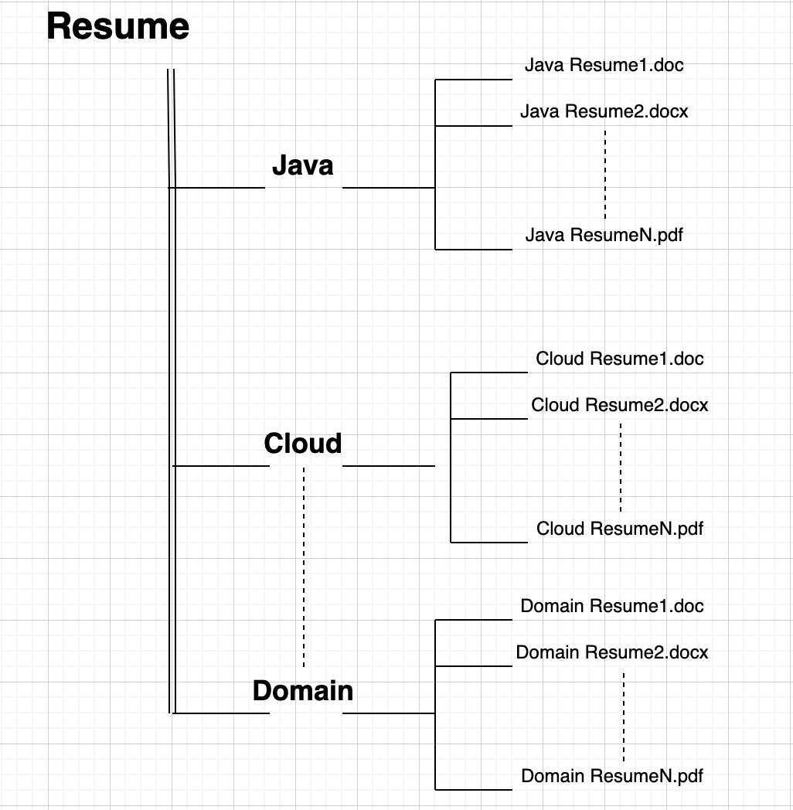

# Resume Classification

## Objective

Aim of this project is to train a set of resumes of specific domain and create a machine learning model 
to predict the unseen resumes.

Currently the model is trained using logistic regression on these four domain:
  - Java
  - Cloud
  - Big Data
  - Machine Learning

Resumes are read using a package called **tika** which supports many file formats including the following popular ones:

    - doc
    - docx
    - pdf

NOTE: To know more about tika visit the following link: https://pypi.org/project/tika/

## Installation

`pip install resume_classification`

## Dependencies

- numpy==1.17.3
- pandas==0.25.1
- tika==1.24
- nltk==3.4.5

### Python version
    `Python 3.7.4`

## Project Guidelines

- Train
  
  In order to train a new set of resumes, the project ought to have a defined folder structure given below:

      
  
  Then run the following commands:
  
  `from resume_classification import train`
  
  `train(path-to-resumes-folder)`
  
  ### Output
  
  The output will consist of the following metrics
    - Model Accuracy
    - F1 Score
    - Confusion Matrix
 
 - Predict
    
   Use the following command:
   
   `from resume_classification import predict`
   
   `predict(path-to-resumes)`
   
   **NOTE** for predict module, the path to resume will contain all the unseen resumes in a single folder.
   
    ### Output
  
    The output will be a dataframe consisting of `file name` and `predicted domain`.